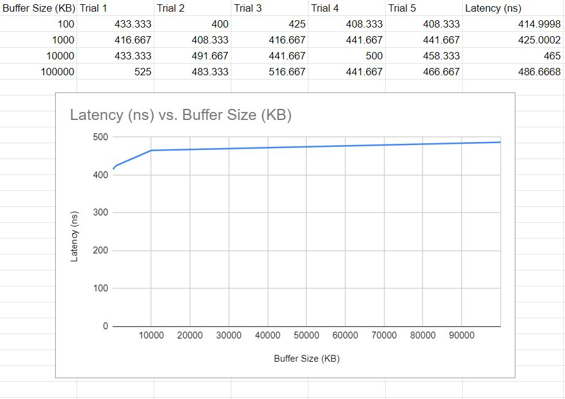

# Benchmarking the Memory Hierarchy
## Program Overview:
- Measure the latency of reading a byte from memory out of a buffer of N bytes, while varying N through different sizes
- For each size N, loop many times to read a byte from a pre-allocated buffer of size N, measure the latency of this copy, then print it out
- output two columns: length of the buffer (N) in bytes and the estimate mean time in nanoseconds to copy a single byte from the buffer

## Implementation
- To implement a buffer, I am using a string of chars (each 1 byte)
- The timing method I am using to measure the latency of reading a byte from memory of a buffer is the in the chrono library
- In order to obtain a more consistent amount of time for testing, each buffer of N bytes is iterated 10 times with there being four reads/ copies of a byte per iteration

## Compilation
- Compile with "make"

## Mean Latency per Memory Read (ns) vs. Buffer Size (KB) Graph

## Analysis
- Since there seems to be an increase in Mean Latency per Memory Read between a buffer size of 100 KB and 1000 KB, the L1 cache in my CPU is around 100 KB. It's less clear what size the L2 and L3 caches would be, but the L2 cache should also around 100 KB - 1000 KB and the L3 cache around 10000 KB - 100000 KB.
- The actual CPU cache sizes of my computer are as follows

| CPU Caches    | Size              |
| ------------- |:-----------------:|
| L1            | 64 KB (per core)  |
| L2            | 256 KB (per core) |
| L3            | 12 MB (shared)    |
